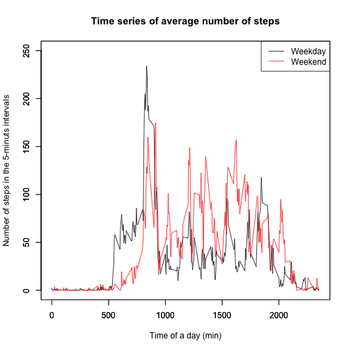

# Reproducible Research: Peer Assessment 1

## Loading and preprocessing the data

```r
data <- read.csv("activity.csv")
data$date <- as.Date(data$date)
cleanData <- data[is.na(data$steps) == FALSE, ]
```
## What is mean total number of steps taken per day?
#### Make a histogram of the total number of steps taken each day

```r
steps.each.day <- tapply(cleanData$steps, cleanData$date, sum)
hist(steps.each.day, breaks = 10)
```

 

#### Calculate and report the mean and median total number of steps taken per day

```r
summary(steps.each.day)
```

```
##    Min. 1st Qu.  Median    Mean 3rd Qu.    Max. 
##      41    8840   10800   10800   13300   21200
```
## What is the average daily activity pattern?
#### Make a time series plot (i.e. type = "l") of the 5-minute interval (x-axis) and the average number of steps taken, averaged across all days (y-axis)

```r
average.steps.interval <- tapply(cleanData$steps, cleanData$interval, mean)
plot(average.steps.interval, type = "l")
```

 

#### Which 5-minute interval, on average across all the days in the dataset, contains the maximum number of steps?

```r
max.step <- max(average.steps.interval)
average.steps.interval[average.steps.interval == max.step]
```

```
##   835 
## 206.2
```
So, the answer is 835th 5-miute interval contains the maximum number of steps, 206.1698.

## Imputing missing values
Note that there are a number of days/intervals where there are missing values (coded as NA). The presence of missing days may introduce bias into some calculations or summaries of the data.

#### Calculate and report the total number of missing values in the dataset (i.e. the total number of rows with NAs)

```r
nrow(data)
```

```
## [1] 17568
```

```r
sum(is.na(data$steps))
```

```
## [1] 2304
```
So, 2304 out of  17568 is missing values.

#### Devise a strategy for filling in all of the missing values in the dataset. The strategy does not need to be sophisticated. For example, you could use the mean/median for that day, or the mean for that 5-minute interval, etc.

Check the missing values in  the mean/median for that day

```r
average.steps.date <- tapply(cleanData$steps, cleanData$date, mean)
sum(is.na(average.steps.date))
```

```
## [1] 0
```

```r
median.steps.date <- tapply(cleanData$steps, cleanData$date, median)
sum(is.na(median.steps.date))
```

```
## [1] 0
```
This indicates that we cannot use the mean/median for that day to fill in all of the missing values in the dataset. On the other hand, we can use the mean for that 5-minute interval, as indicated below.

```r
sum(is.na(average.steps.interval))
```

```
## [1] 0
```

#### Create a new dataset that is equal to the original dataset but with the missing data filled in.

A new dataset is created by the mean for that 5-minute interval filled in to miissing data.

```r
for(i in 1:nrow(data)) {
   if (is.na(data[i,1])) {
       a <- data[i,3]
       b<- names(average.steps.interval) == as.character(a) 
       data[i,1] <- as.numeric(average.steps.interval[b])
       }
    }
```

Check the nmuber of missing values in the new dataset

```r
sum(is.na(data$steps))
```

```
## [1] 0
```

#### Make a histogram of the total number of steps taken each day and Calculate and report the mean and median total number of steps taken per day. Do these values differ from the estimates from the first part of the assignment? What is the impact of imputing missing data on the estimates of the total daily number of steps?

```r
steps.each.day2 <- tapply(data$steps, data$date, sum)
hist(steps.each.day2, breaks = 10)
```

 

```r
summary(steps.each.day2)
```

```
##    Min. 1st Qu.  Median    Mean 3rd Qu.    Max. 
##      41    9820   10800   10800   12800   21200
```
## Are there differences in activity patterns between weekdays and weekends?
make datasets for weekdays and weekends.

```r
data$weekday <- weekdays(data$date)
data.weekday <- data[!(data$weekday == "Saturday" | data$weekday == "Sunday"), ]
data.weekend <- data[(data$weekday == "Saturday" | data$weekday == "Sunday"), ]
```
Compare the histograms of the total number of steps taken each day

```r
WDsteps.each.day <- tapply(data.weekday$steps, data.weekday$date, sum)
WEsteps.each.day <- tapply(data.weekend$steps, data.weekend$date, sum)
par(mfrow = c(1,2))
hist(WDsteps.each.day, breaks = 10)
hist(WEsteps.each.day, breaks = 10)
```

 
Compare time series plot of the 5-minute interval (x-axis) and the average number of steps taken, averaged across all days (y-axis)

```r
WDaverage.steps.interval <- tapply(data.weekday$steps, data.weekday$interval, mean)
WEaverage.steps.interval <- tapply(data.weekend$steps, data.weekend$interval, mean)
par(mfrow = c(1,2))
plot(WDaverage.steps.interval, type = "l")
plot(WEaverage.steps.interval, type = "l")
```

 
