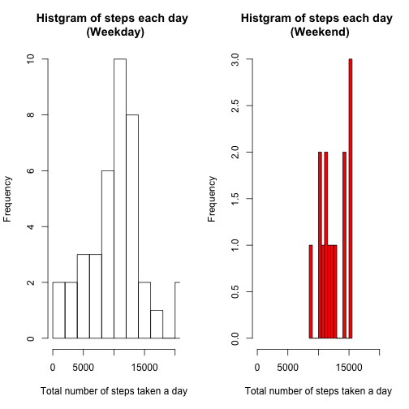

# Reproducible Research: Peer Assessment 1

## Loading and preprocessing the data
Data file "activity.csv" is in the working directory. 

```r
data <- read.csv("activity.csv") #Loading the data
data$date <- as.Date(data$date)  #date is converted to date class
cleanData <- data[is.na(data$steps) == FALSE, ] #remove rows having NA values
```
## What is mean total number of steps taken per day?
#### Make a histogram of the total number of steps taken each day

```r
steps.each.day <- tapply(cleanData$steps, cleanData$date, sum)
hist(steps.each.day, breaks = 10, xlab = "Total number of steps taken a day",
     main = "Histgram of steps each day")
```

 

#### Calculate and report the mean and median total number of steps taken per day

```r
summary(steps.each.day)
```

```
##    Min. 1st Qu.  Median    Mean 3rd Qu.    Max. 
##      41    8840   10800   10800   13300   21200
```
## What is the average daily activity pattern?
#### Make a time series plot (i.e. type = "l") of the 5-minute interval (x-axis) and the average number of steps taken, averaged across all days (y-axis)

```r
average.steps.interval <- tapply(cleanData$steps, cleanData$interval, mean)
plot(as.numeric(names(average.steps.interval)), average.steps.interval, 
     type = "l", xlab = "Time of a day (min)",
     ylab = "Number of steps in the 5-minuts intervals", 
     main = "Time series of average number of steps")
```

 

#### Which 5-minute interval, on average across all the days in the dataset, contains the maximum number of steps?

```r
max.step <- max(average.steps.interval)
average.steps.interval[average.steps.interval == max.step]
```

```
##   835 
## 206.2
```
So, the answer is the 5-miute interval starting from 835 minute contains the maximum number of steps, 206.1698.
## Imputing missing values
Note that there are a number of days/intervals where there are missing values (coded as NA). The presence of missing days may introduce bias into some calculations or summaries of the data.

#### Calculate and report the total number of missing values in the dataset (i.e. the total number of rows with NAs)

```r
nrow(data) ## Total number of data.
```

```
## [1] 17568
```

```r
sum(is.na(data$steps)) ## Number of missing values.
```

```
## [1] 2304
```
So, 2304 out of  17568 is missing values.

#### Devise a strategy for filling in all of the missing values in the dataset. The strategy does not need to be sophisticated. For example, you could use the mean/median for that day, or the mean for that 5-minute interval, etc.

Check how many date factors are in orignal data and cleaned data (NA omitted).

```r
length(levels(factor(data$date)))  ## Number of date factors in the original data
```

```
## [1] 61
```

```r
length(levels(factor(cleanData$date))) ## Number of date factors in the cleaned data
```

```
## [1] 53
```
This indicates that we cannot use the mean/median for that day to fill in all of the missing values in the dataset, because those values cannot fill the missing valuse of some of days. On the other hand, we can use the mean for that 5-minute interval, as indicated below.

```r
length(levels(factor(data$interval))) ## Number of interval factors in the original data
```

```
## [1] 288
```

```r
length(levels(factor(cleanData$interval))) ## Number of interval factors in the cleaned data
```

```
## [1] 288
```

#### Create a new dataset that is equal to the original dataset but with the missing data filled in.

A new dataset is created by the mean for that 5-minute interval filled in to miissing data.

```r
for(i in 1:nrow(data)) {
   if (is.na(data[i,1])) {
       a <- data[i,3]
       b<- names(average.steps.interval) == as.character(a) 
       data[i,1] <- as.numeric(average.steps.interval[b])
       }
    }
```

Check the nmuber of missing values in the new dataset.

```r
sum(is.na(data$steps))
```

```
## [1] 0
```
We get "0", meaning all missing values were filled.

#### Make a histogram of the total number of steps taken each day and Calculate and report the mean and median total number of steps taken per day. Do these values differ from the estimates from the first part of the assignment? What is the impact of imputing missing data on the estimates of the total daily number of steps?
Compare the histgrams of filled data nad cleaned data.

```r
steps.each.day2 <- tapply(data$steps, data$date, sum)
par(mfrow = c(1,2))
hist(steps.each.day2, breaks = 10, xlab = "Total number of steps taken a day",
     main = "Histgram of steps each day \n (filled data)")
hist(steps.each.day, breaks = 10, xlab = "Total number of steps taken a day",
     main = "Histgram of steps each day \n (cleaned data from the first part)")
```

 

The impact here is that the peak of the histgram gets higher.   

Compare the mean and median.

```r
summary(steps.each.day2) ## filled data
```

```
##    Min. 1st Qu.  Median    Mean 3rd Qu.    Max. 
##      41    9820   10800   10800   12800   21200
```

```r
summary(steps.each.day) ## cleaned data from the first part of the assigmnet
```

```
##    Min. 1st Qu.  Median    Mean 3rd Qu.    Max. 
##      41    8840   10800   10800   13300   21200
```
The mean and median do not change.

## Are there differences in activity patterns between weekdays and weekends?
Make datasets for weekdays and weekends.

```r
cleanData$weekday <- weekdays(cleanData$date) ## add column of days of week.
data.weekday <- cleanData[!(cleanData$weekday == "Saturday" | cleanData$weekday == "Sunday"), ]
data.weekend <- cleanData[(cleanData$weekday == "Saturday" | cleanData$weekday == "Sunday"), ]
```
Compare the histograms of the total number of steps taken each day

```r
WDsteps.each.day <- tapply(data.weekday$steps, data.weekday$date, sum)
WEsteps.each.day <- tapply(data.weekend$steps, data.weekend$date, sum)
par(mfrow = c(1,2))
hist(WDsteps.each.day, breaks = 10, xlab = "Total number of steps taken a day",
     main = "Histgram of steps each day \n (Weekday)", xlim = c(0,20000))
hist(WEsteps.each.day, breaks = 10,  xlab = "Total number of steps taken a day",
     main = "Histgram of steps each day \n (Weekend)", col = "red", xlim = c(0, 20000))
```

 


Compare time series plot of the 5-minute interval (x-axis) and the average number of steps taken, averaged across all days (y-axis)

```r
WDaverage.steps.interval <- tapply(data.weekday$steps, data.weekday$interval, mean)
WEaverage.steps.interval <- tapply(data.weekend$steps, data.weekend$interval, mean)
par(mfrow = c(1,1))
plot(as.numeric(names(WDaverage.steps.interval)), WDaverage.steps.interval, 
     type = "l", xlab = "Time of a day (min)",
     ylab = "Number of steps in the 5-minuts intervals", 
     main = "Time series of average number of steps", ylim = c(0,250))
par(new = TRUE)
plot(as.numeric(names(WEaverage.steps.interval)), WEaverage.steps.interval, 
     type = "l", xlab = " ", ylab = " ", main = " ", ylim = c(0,250), col = "red")
legend("topright", c("Weekday","Weekend"), col = c("black", "red"), lty =c(1,1))
```

 
